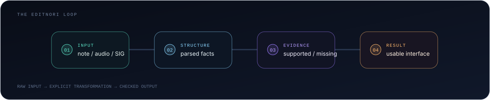

  <picture>
    <source media="(max-width: 600px)" srcset="./assets/editnori-hero-mobile.svg" />
    
  </picture>

  <strong>Layth Qassem, PharmD, MS</strong> 
  Clinical informatics, on-device AI, and tools built around the evidence they return.

  
  
  

## Audio becomes live captions inside the browser

[Local Subtitles](https://github.com/editnori/local-subtitles) turns audio from the active Chrome tab into live English captions because Moonshine Streaming Tiny processes the stream in the browser. Transcript lines return to the video overlay as live English captions. Local-first means the tab audio and transcript text stay in the browser. The extension has no transcript history, analytics, account, or application server.

Editnori projects apply that path to different inputs. A note, prescription instruction, audio stream, or agent event is structured, checked against its evidence and constraints, then returned through an interface that keeps the supported result visible.

  <picture>
    <source media="(max-width: 600px)" srcset="./assets/editnori-loop-mobile.svg" />
    
  </picture>

## Selected builds

> ### 01 · [Local Subtitles](https://github.com/editnori/local-subtitles)
> Live English captions for the active Chrome tab, processed locally with streaming WebAssembly speech recognition. No transcript history or application server.
>
> `JavaScript` `WebAssembly` `Chrome MV3`

> ### 02 · [Nota](https://github.com/editnori/nota)
> Desktop clinical-note annotation, review, and formatting with local persistence and shareable sessions.
>
> `TypeScript` `Tauri` `local-first`

> ### 03 · [Psych Intake Brief](https://github.com/editnori/psych-intake-brief)
> A structured psychiatric-intake workflow with local document parsing, per-section evidence ranking, and citation tracking.
>
> `TypeScript` `Rust` `evidence workflow`

> ### 04 · [ToneGuard](https://github.com/editnori/toneguard)
> Writing lint plus flow, dependency, call-graph, and control-flow artifacts for concrete code review.
>
> `Rust` `VS Code` `static analysis`

> ### 05 · [Codex Rolling Auth](https://github.com/editnori/codex-rolling-auth)
> A small shell wrapper and TUI that selects among saved Codex auth profiles while preserving normal CLI launches.
>
> `Shell` `Python` `Codex CLI`

> ### 06 · [PythonMetaMap](https://github.com/editnori/PythonMetaMap)
> A Python wrapper that manages MetaMap servers, parallel file processing, failure recovery, and clinical analysis.
>
> `Python` `MetaMap` `clinical NLP`

 

**The constraints stay visible**

- Local data stays local when the workflow allows it.
- A transformation should show what it accepted, changed, and could not prove.
- A polished interface still has to expose failure, current state, and the next action.

  
  
  
  
  
  

  
<strong>More public experiments</strong>

   
  <a href="https://github.com/editnori/GRM2025">GRM2025</a> ·
  <a href="https://github.com/editnori/WinMux">WinMux</a> ·
  <a href="https://github.com/editnori/analogue-pocket-fastforward-guide">Analogue Pocket fast-forward guide</a> ·
  <a href="https://github.com/editnori/codex-gemini-ui-sidecar">Codex Gemini UI sidecar</a>

   
  Build the path. Keep the evidence. Make the result usable.

